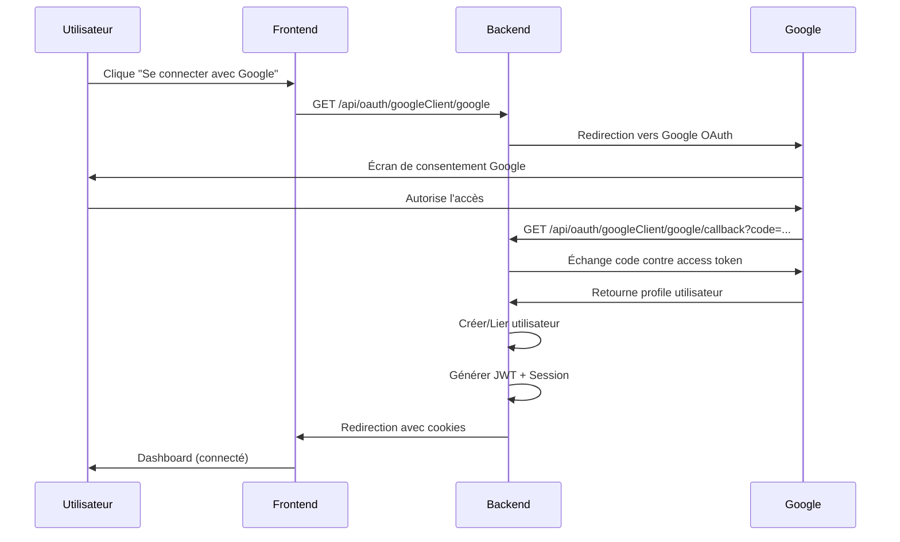

# 🔐 Configuration OAuth Google - Guide Complet

## ✅ Problèmes Corrigés

### **1. Routes Dupliquées** ✅
- **Avant:** Deux routes `/google/callback` identiques
- **Après:** Route `/google` pour initier + `/google/callback` pour le callback

### **2. Configuration Passport** ✅
- **Avant:** Credentials vides (clientID, clientSecret, callbackURL)
- **Après:** Configuration depuis `env.Config` avec gestion complète des cas

### **3. Création JWT/Session** ✅
- **Avant:** Redirection simple sans token
- **Après:** Génération JWT + création session + cookies httpOnly

### **4. Schéma Prisma** ✅
- **Avant:** `googleId String?` (non unique)
- **Après:** `googleId String? @unique` + `onDelete: Cascade` pour sessions

### **5. Gestion Utilisateurs** ✅
- Liaison compte Google à compte existant si même email
- Génération username unique automatique
- Vérification email automatique via Google

### **6. Initialisation Passport** ✅
- Import et initialisation dans `index.ts`
- `passport.initialize()` middleware ajouté

### **7. Variables d'Environnement** ✅
- Ajout `GOOGLE_CLIENT_ID`, `GOOGLE_CLIENT_SECRET`
- Ajout `BACKEND_URL`, `NEXT_CLIENT`

---

## 📦 Installation des Dépendances

```bash
npm install passport passport-google-oauth20
npm install --save-dev @types/passport @types/passport-google-oauth20
```

---

## 🔧 Configuration

### **1. Obtenir les Credentials Google**

1. Aller sur [Google Cloud Console](https://console.cloud.google.com/)
2. Créer un nouveau projet ou sélectionner un projet existant
3. Activer **Google+ API**
4. Aller dans **Credentials** → **Create Credentials** → **OAuth 2.0 Client ID**
5. Configurer l'écran de consentement OAuth
6. Type d'application: **Web application**
7. Ajouter les URIs de redirection autorisées :
   ```
   http://localhost:3000/api/oauth/googleClient/google/callback
   http://localhost:8080/api/oauth/googleClient/google/callback
   ```
8. Copier le **Client ID** et **Client Secret**

### **2. Configurer les Variables d'Environnement**

Créez ou mettez à jour votre fichier `.env` :

```env
# OAuth Google
GOOGLE_CLIENT_ID=votre_client_id_ici.apps.googleusercontent.com
GOOGLE_CLIENT_SECRET=votre_client_secret_ici

# URLs
BACKEND_URL=http://localhost:3000
NEXT_CLIENT=http://localhost:3000  # URL de votre frontend

# Autres variables existantes
NODE_ENV=development
PORT=3000
DATABASE_URL=postgresql://...
JWT_SECRET_KEY=...
JWT_REFRESH_SECRET=...
RESEND_KEY=...
```

### **3. Copier le Fichier de Configuration**

Si ce n'est pas déjà fait :

```bash
cp src/config/env/env.Config.example.ts src/config/env/env.Config.ts
```

### **4. Migrer la Base de Données**

```bash
# Générer la migration
npx prisma migrate dev --name add_oauth_google

# Ou si problème
npx prisma db push

# Générer le client Prisma
npx prisma generate
```

---

## 🚀 Utilisation

### **Flux d'Authentification OAuth**



### **Endpoints**

#### **1. Initier l'Authentification**
```
GET /api/oauth/googleClient/google
```

**Usage Frontend (React/Next.js):**
```tsx
const handleGoogleLogin = () => {
  window.location.href = "http://localhost:3000/api/oauth/googleClient/google";
};

<button onClick={handleGoogleLogin}>
  Se connecter avec Google
</button>
```

#### **2. Callback (Automatique)**
```
GET /api/oauth/googleClient/google/callback
```

Ce endpoint est appelé automatiquement par Google après l'authentification.

**Redirections possibles:**
- ✅ Succès: `http://localhost:3000/dashboard?oauth=success`
- ❌ Échec OAuth: `http://localhost:3000/login?error=oauth_failed`
- ❌ Pas d'utilisateur: `http://localhost:3000/login?error=no_user`
- ❌ Erreur session: `http://localhost:3000/login?error=session_failed`

---

## 🔒 Sécurité

### **Stratégies Implémentées**

✅ **Tokens httpOnly** - Cookies sécurisés non accessibles via JavaScript  
✅ **Session Tracking** - Device, OS, Browser, IP enregistrés  
✅ **Email Vérifié Automatiquement** - Via Google OAuth  
✅ **Liaison de Comptes** - Si email existe déjà, lie le compte Google  
✅ **Username Unique** - Génération automatique si collision  
✅ **CSRF Protection** - sameSite: "lax" sur les cookies  
✅ **Cascade Delete** - Sessions supprimées avec l'utilisateur  

### **Bonnes Pratiques**

1. **En production:**
   - Utilisez HTTPS uniquement
   - Configurez `secure: true` pour les cookies
   - Changez `sameSite: "strict"` ou "lax" selon votre setup
   - Whitelist les domaines dans Google Cloud Console

2. **Variables d'environnement:**
   - Ne commitez JAMAIS les credentials Google
   - Utilisez des secrets différents pour dev/staging/prod

3. **Monitoring:**
   - Loggez les tentatives d'authentification
   - Alertes sur échecs répétés
   - Rate limiting sur les endpoints OAuth

---

## 🧪 Tests

### **Test Manuel**

1. Démarrer le serveur :
   ```bash
   npm run dev
   ```

2. Ouvrir le navigateur :
   ```
   http://localhost:3000/api/oauth/googleClient/google
   ```

3. Se connecter avec Google

4. Vérifier la redirection vers le dashboard

5. Vérifier dans la base de données :
   ```bash
   npx prisma studio
   ```
   - Utilisateur créé
   - googleId présent
   - Session créée

### **Test avec cURL (pour le callback)**

```bash
# Obtenir le code OAuth manuellement puis :
curl -X GET "http://localhost:3000/api/oauth/googleClient/google/callback?code=YOUR_CODE"
```

---

## 📊 Structure des Données

### **User avec OAuth**

```typescript
{
  id: "cm...",
  email: "user@gmail.com",
  firstName: "John",
  lastName: "Doe",
  username: "john",
  password: "",  // Vide pour OAuth
  googleId: "1234567890",  // ID Google unique
  picture: "https://lh3.googleusercontent.com/...",
  emailVerified: true,  // Auto-vérifié par Google
  role: "USER",
  createdAt: "2025-01-01T00:00:00.000Z"
}
```

### **Session OAuth**

```typescript
{
  id: "session_id",
  userId: "cm...",
  userAgent: "Mozilla/5.0...",
  device: "Desktop",
  browser: "Chrome",
  os: "Windows",
  ip: "127.0.0.1",
  location: "Unknown",
  platform: "Web",
  expiresAt: "2025-01-08T00:00:00.000Z"
}
```

---

## 🔄 Workflow Complet

### **Scénario 1: Nouvel Utilisateur**
1. Utilisateur clique "Google Login"
2. Google authentifie l'utilisateur
3. Backend crée un nouvel utilisateur
4. Username généré automatiquement (ex: "john", "john1", etc.)
5. JWT + Session créés
6. Cookies définis
7. Redirection vers dashboard

### **Scénario 2: Utilisateur Existant (avec Google)**
1. Utilisateur clique "Google Login"
2. Google authentifie
3. Backend trouve l'utilisateur par `googleId`
4. JWT + Session créés
5. Redirection vers dashboard

### **Scénario 3: Liaison de Compte**
1. Utilisateur s'est inscrit manuellement (email + password)
2. Plus tard, clique "Google Login" avec le même email
3. Backend trouve l'utilisateur par email
4. Ajoute le `googleId` au compte existant
5. Marque `emailVerified = true`
6. JWT + Session créés
7. Maintenant l'utilisateur peut se connecter via email OU Google

---

## ⚠️ Troubleshooting

### **Erreur: "redirect_uri_mismatch"**
- Vérifiez que l'URI de callback est exactement la même dans Google Cloud Console
- Format: `http://localhost:3000/api/oauth/googleClient/google/callback`

### **Erreur: "GOOGLE_CLIENT_ID is not defined"**
- Vérifiez votre fichier `.env`
- Redémarrez le serveur après modification du `.env`
- Vérifiez que `env.Config.ts` est créé (copié depuis example)

### **Utilisateur créé mais pas de JWT**
- Vérifiez les logs dans la console
- Vérifiez que `JWT_SECRET_KEY` est défini
- Vérifiez que la session a bien été créée dans Prisma Studio

### **Redirection infinie**
- Vérifiez que les cookies sont bien définis
- Vérifiez la configuration CORS (credentials: true)
- Vérifiez que `sameSite` est "lax" en développement

---

## 📚 Documentation Complémentaire

- [Passport.js Documentation](http://www.passportjs.org/docs/)
- [Google OAuth 2.0](https://developers.google.com/identity/protocols/oauth2)
- [Prisma Relations](https://www.prisma.io/docs/concepts/components/prisma-schema/relations)

---

## ✅ Checklist de Déploiement

Avant de déployer en production :

- [ ] Credentials Google configurés pour le domaine de production
- [ ] `BACKEND_URL` et `NEXT_CLIENT` pointent vers les URLs de production
- [ ] Cookies avec `secure: true` et `sameSite: "strict"`
- [ ] HTTPS activé
- [ ] Rate limiting sur les endpoints OAuth
- [ ] Monitoring des erreurs OAuth
- [ ] Tests end-to-end OAuth
- [ ] Backup de la base de données
- [ ] Documentation pour l'équipe

---

**🎉 Votre implémentation OAuth Google est maintenant complète et production-ready !**
